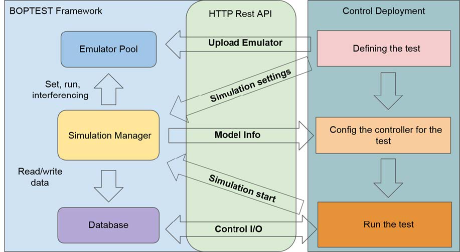
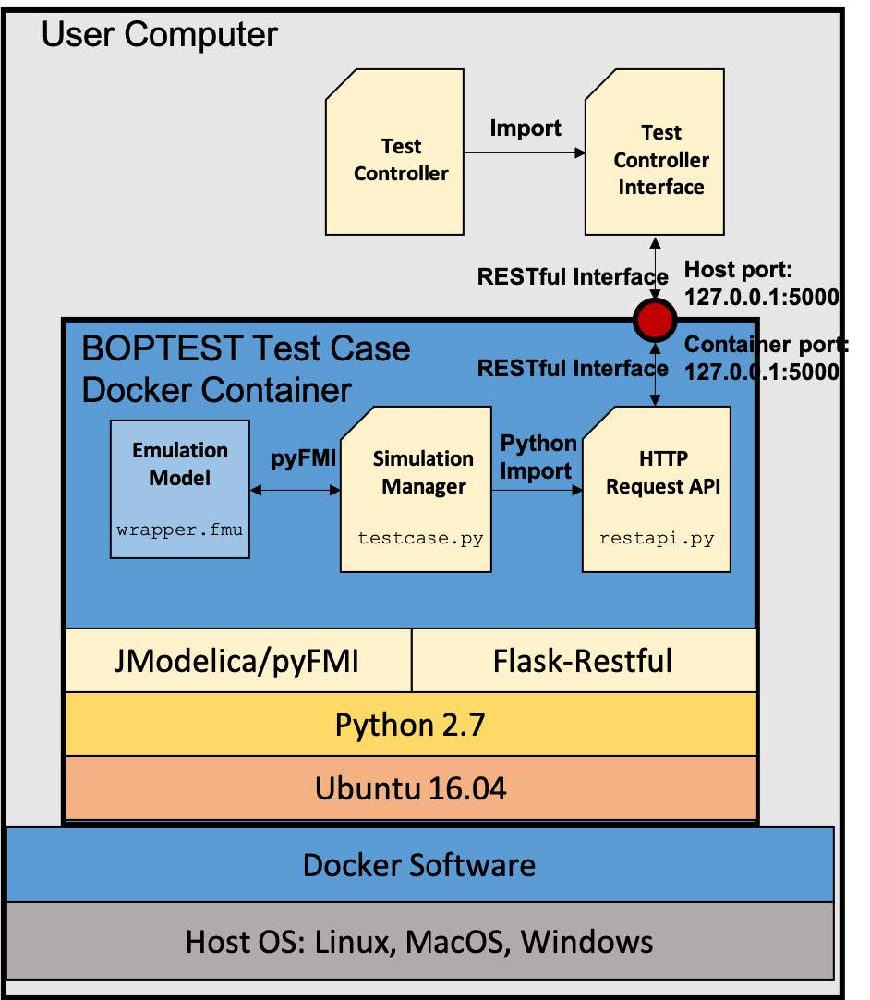

A paper plan for comparing MPC and DRL/TL in building control

- [Objectives](#objectives)
- [Methodology](#methodology)
- [Building System Model](#building-system-model)
- [Progresses](#progresses)
  - [10/26/2020](#10262020)
    - [Next Steps](#next-steps)
  - [10/30/2020](#10302020)
    - [BOPTEST Software Structure](#boptest-software-structure)
- [Meetings](#meetings)
  - [10/28/2020](#10282020)
  - [11/13/2020](#11132020)
  - [11/20/2020](#11202020)
  - [03/01/2021](#03012021)
  - [03/23/2021](#03232021)
  - [04/05/2021](#04052021)
  - [04/06/2021](#04062021)
  

# Objectives

The purpose here is to investigate how the performance of transfer learning control compared with model predictive control in building energy system.

# Methodology

# Building System Model

# Progresses
## 10/26/2020 
*Deep Reinforcement Learning for Building HVAC Control*: develop a data-driven approach that leverages the deep reinforcement learning (DRL) technique, to intelligently learn the effective strategy for operating the building HVAC systems. We evaluate the performance of our DRL algorithm through simulations using the widely-adopted EnergyPlus tool. Experiments demonstrate that our DRL-based algorithm is more effective in energy cost reduction compared with the traditional rule-based approach, while maintaining the room temperature within desired range.

*One for Many: Transfer Learning for Building HVAC Control*: this paper proposes a tranfer learning control for buildings. The DRL-based control trained from one building is numercially demonstrated to be transfereable to other buildings and locations.

Energyplus is used as a building simulator. The objective of the control is to minimize energy costs while maitaining zone temperature within bounds by controlling the air flow rate in each VAV terminal box.

> $\vec u$: control inputs for building model, here is the flowrate or VAV damper position

> $\vec y$: system response from building model, here is the energy usage.

> $\vec x$: system states from building model, here is the zone temperatures.

For Modelica implementation, we can use existing five-zone system model to predict zone temperature and system-level energy.

***Questions***
1. $\vec u$ in Modelica model should be damper postions. Otherwise, calculating fan power requires a fan power model based on flowrate. Current implementation is based on fan speed and fan pressure head.

***DRL Platform in Modelica***

Here an integrated environment is configured and contained in a docker file. The environment contains:
   - Pytorch: for DRL development as used in NU's papers.
   - jModelica: Modelica-based building model. This part is to provide simulation capability of Modelica models.
   - Opengym: Interface for using Modelica models as DRL environment.

Detailed configuration is in `Dockerfile`.

### Next Steps
- [ ] test VAV.fmu compilation and simulation
- [ ] configure DRL environment using VAV.fmu
- [ ] develop MPC for VAV model

## 10/30/2020

An intermediate idea is to use existing testcases developed from BOPTEST, which contains residential building with single zone and 8 zones, commercial buildings with single zone, 28-zone office, and 32-zone office.

### BOPTEST Software Structure

*Emulator Pool* - contains source files of the test cases and temporary files during simulation

*Database*: 

*Simulation Manager*: simulation environment, parses the source files of the emulators.

*HTTP Rest API*: main point of interaction with the BOPTEST platform. Via the HTTP Rest API, the external controller as a client can submit requests for actions such as adding or selecting an emulator to test, extracting information about the emulator, setting simulation settings, starting a simulation, and reading/writing control signal and measurement data.

Emulation model is `wrapper.fmu`.

Simulation manager is `testcase.py`.

HTTP Request API is `restapi.py`.

# Meetings

## 10/28/2020

NU discussed their conceptual design of fault-tolerant deep reinforcement learning control framework.

They proposed an evloving virtual environment to learn system states based on historical virtual data. The predicted value in the virtual environment is compared with measured data from actual environment. If difference is small, have confidence over current measurement. If difference is large, use data from virtual environement.

## 11/13/2020

NU mentioned their needs in the following quoted email:

    Instead of making 5 models for EnergyPlus as we discussed in the morning, could you make one specific-coarse model pair first?

Other information for the models:

    1. control inputs: discrete VAV terminal mass flowrate; for example, 5 level between 0 and maximum flow. This requires revisions of current Modelica VAV terminal model.
    2. control objectives: minimize energy use while maintain room temperature

## 11/20/2020

A short meeting with Shichao:

1. They prefer multi-zones.

2. reward is calculated based on power, and the power in their learning is a model based on outdoor temperatures?

3. they want use future 4-step weather data

## 03/01/2021

The baseline case has a few limitations:

1. the system total power is not very sensitive to fan air supply amount during off design condition. During a normal operation, the fan power is only about ~ 10% of system total power. This is related to system sizing in the Modelica model. 

    *Design condition*: For fan, nominal flow rate is 0.75 kg/s, nominal DP is 500 Pa, then the nominal power is about $\dot m*dp/\rho/\eta=0.75*500/1.28/0.49 \approx 600 W$.
    For Chiller, the design power is $7000/5.5 = 1273 W$.

    *Off-design condition*: The fan runs at partial load, the power is usually $100-200 W$, and the chiller is usually $1200 W$.

2. VAV local terminal control (airflow rate) is not a good enough control variable for optiming system level power. The airflow rate setpoint will influecnce the chilled water plant control. For instance, if the setpoint is too high, the zone could be over-cooled, and thus chiller might be turned off, which could save a lot of energy. The frequent on/off of chiller should be avoided in real applications. 
   1. An alternative is to control zone temperature setpoint.

## 03/23/2021
Current issue is zone temperature predictor cannot predict the correct trends, i.e., the more air in the zone, the more temperature changes in the zone, although the prediction of the temperature is within a small error tolerance.

Following attempts have been tried:
1. train a ANN model instead of linear ARX model
2. use average data within a sample interval instead of a value at the sampling timestamp

MPC control performance are significantly increased.

## 04/05/2021
Previous single zone model has an issue that the fan is on at its minimum speed at night, which leads to the control of supply air temperature at 13C at night, thus the zone temperature is very close to 13C if the outdoor air temperature is low, which might trigger the heating unit when the temperature is lower than 12C.

Some updates:
- change previous P controller into PI controller
- reset PI at the beginning of each day
- remove hystersis controller for chiller to avoid time events to save time

## 04/06/2021
Overwriting fan speed signal from external sources will lead to the wrong fan status output from supervisory controller. For example, when fan is activated at night, the fan on/off controller that uses occupancy information still think the fan is off.