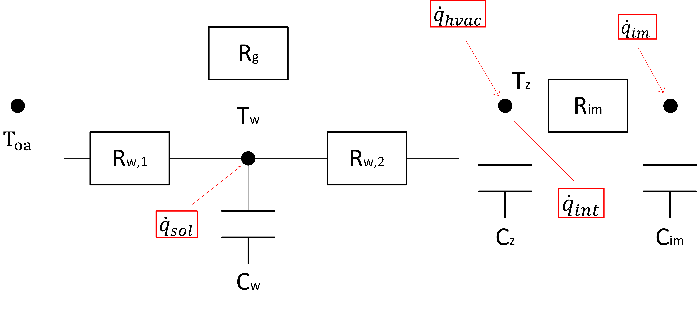

# MPC Formulation

$\min_{U_t} \sum_{k=0}^{h-1} (w_1p_{t+k}P_{t+k}\Delta t + w_2\|\Delta u_{t+k}\|_2$

$S.T.$

$\dot q_{l,t+k} = f_{RC}(U_t)$

$\dot q_{l,t+k} \le \overline{\dot q}_{dx,t+k}$

$P_{t+k} = \sum_{i=0}^{n}\alpha_i \dot q_{l,t+k}^i + \sum_{i=0}^{m} \beta_i T_{oa,t+k}^i$

$\Delta u_{t+k} = u_{t+k} - u_{t+k-1}$

$\underline{U}_t \le U_t \le \overline{U}_t$

# RC Thermal Load Predictor

see reference: 
- ***Model Predictive Control for the Operation of Building Cooling Systems***
- ***Parameter estimation of internal thermal mass of buildingdynamic models using genetic algorithm***

At a high level, buildings can be modeled as load demand elements. 
A lumped load model predicts the total energy requested by a building based on date, time, occupancy, and weather. 
The building thermal load predictor predicts the cooling load of buildings, which are conventionally modeled by RC circuit analogy.
The building thermal load model is sketched as below.

The building thermal load predictor calculates the thermal load of the building zones to maintain a specific zone air temperature setpoint ($T_{z,s}$) with external and internal disturbances.
The detailed equations are shown as follows.

$C_{wal,1} \frac{T_{wal,1}}{dt} = \frac{T_{oa} - T_{wal,1}}{R_{wal,1}} + \frac{T_{wal,2}-T_{wal,1}}{R_{wal,2}} +\dot q_{sol,1}$
    
$C_{wal,2}\frac{T_{wal,2}}{dt} = \frac{T_{wal,1} - T_{wal,2}}{R_{wal,2}} + \frac{T_{z,s}-T_{wal,2}}{R_{wal,3}} +\dot q_{sol,2}$
    
$\dot q_l = \dot q_{int}+\frac{T_{oa}-T_{z,s}}{R_{win}}+\frac{T_{wal,2}-T_{z,s}}{R_{wal,3}}$

$\dot q_{sol,1} = \beta_{cld}\dot q_{sol}\theta_1$

$\dot q_{sol,2} = \beta_{cld}\dot q_{sol}\theta_2$

The parameters to  be identified include:
- $\theta_1$: solar load on the external wall mass 
- $\theta_2$: solar load on the internal wall mass
- $R$: thermal resisitance
- $C$: thermal capacitor

*We might want to change the RC to 2R1C for envelope, and a 2R1C for internal mass*

